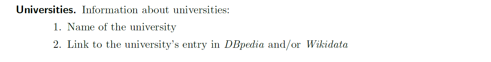
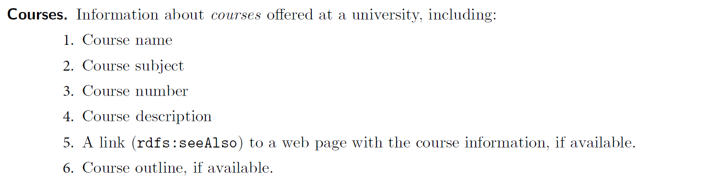
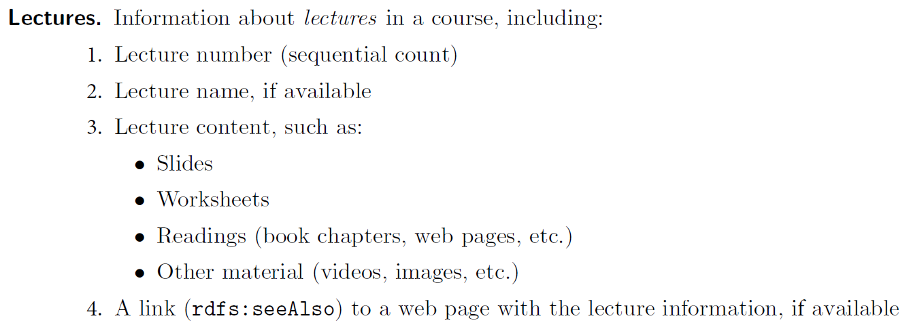
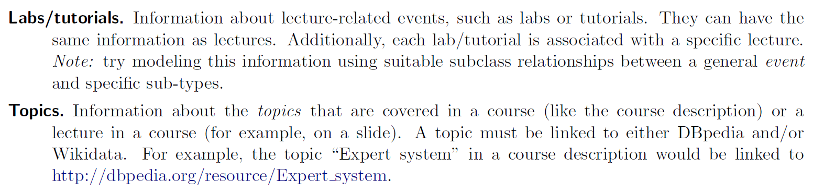
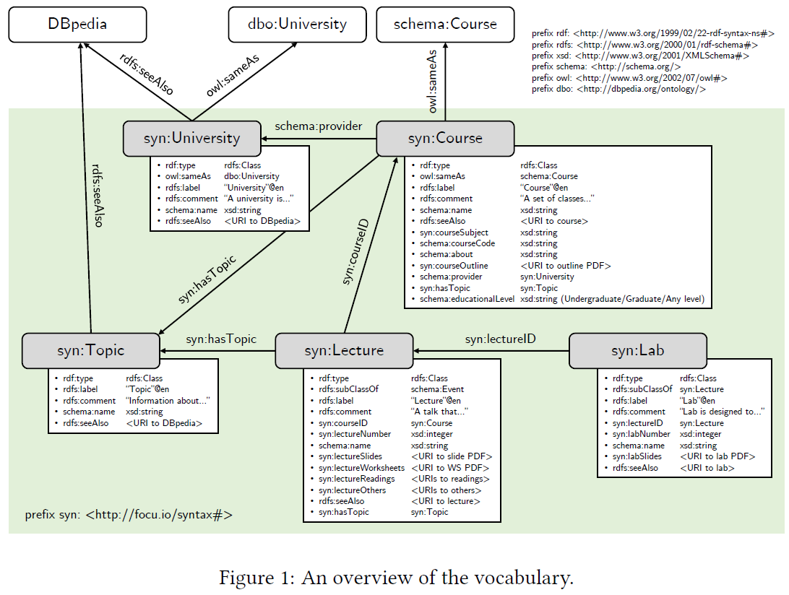
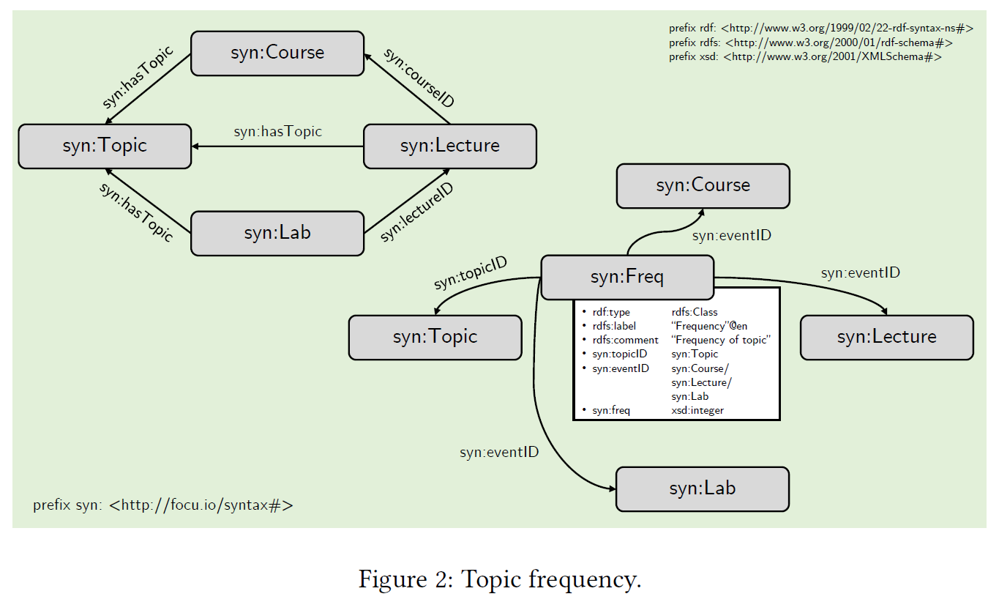

<p align="center"> 
  
</p>
<h1 align="center"> University Chatbot </h1>
<h3 align="center"> An intelligent assistant to answer course-related questions </h3>
</br>

<p align="center"> 
  
</p>

<!-- TABLE OF CONTENTS -->
<h2 id="table-of-contents"> :book: Table of Contents</h2>

<details open="open">
  <summary>Table of Contents</summary>
  <ol>
    <li><a href="#about-the-project"> ➤ About The Project</a></li>
    <li><a href="#prerequisites"> ➤ Prerequisites</a></li>
    <li><a href="#folder-structure"> ➤ Folder Structure</a></li>
    <li><a href="#vocabulary"> ➤ Vocabulary</a></li>
    <li><a href="#knowledge-base-construction"> ➤ Knowledge Base Construction</a></li>
    <li><a href="#preprocessing"> ➤ Data Preprocessing</a></l>
    <li><a href="#references"> ➤ References</a></li>
    <li><a href="#credits"> ➤ Credits</a></li>
  </ol>
</details>


<!-- ABOUT THE PROJECT -->
<h2 id="about-the-project"> :pencil: About The Project</h2>

<p align="justify"> 
  The overall goal of this project is to build Studybot, an intelligent agent that can assist students in the course selection process and also answer university course-related questions using a knowledge graph and natural language processing. To be able to answer questions, Studybot needs knowledge about courses, lectures, and their content. Thus, the first step in this part of the project is the construction of a knowledge graph, built using standard W3C technologies, in particular RDF and RDFS.
</p>

<p> The knowledge graph is modeled to represent such information </p>

<!--  -->
<!--  -->
<!--  -->

<!-- PREREQUISITES -->
<h2 id="prerequisites"> :fork_and_knife: Prerequisites</h2>
 	
<p align="center">
  <a href="https://www.python.org">
      
  </a>
  <a href="https://jupyter.org">
      
  </a>
  <a href="https://www.w3schools.com/html/default.asp">
      
  </a>
  <a href="https://www.w3schools.com/css/default.asp">
      
  </a>
  <a href="https://www.javascript.com">
      
  </a>
  <a href="https://www.ruby-lang.org/en">
      
  </a>
<P/>


  1. Open a `Command Prompt` (NOT `Windows PowerShell`) or a `Terminal`
  2. Create a conda environment `conda create -n is python=3.6.6 -y`
  3. Activate this environment `activate is` (Windows) or `source activate is` (Linux/macOS)
  4. Install the following packages `rasa`, `spacy`, `spacy-dbpedia-spotlight`, `pandas`, `rdflib`, `bs4`, and `validators`:
      - `pip install rasa`
      - `pip install spacy`
      - `python -m spacy download en_core_web_lg`
      - `pip install spacy-dbpedia-spotlight`
      - `pip install pandas`
      - `pip install rdflib`
      - `pip install bs4`
      - `pip install validators`


<!-- :paw_prints:-->
<!-- FOLDER STRUCTURE -->
<h2 id="folder-structure"> :cactus: Folder Structure</h2>

```
code
.
|-- apache-jena-fuseki-3.17.0
|   
|-- queries
|   |                        
|   |-- competency_questions                    <--- SPARQL queries
|       |-- q1.txt
|       |-- q1-out.csv
|       |-- ...         
|
|-- resource                                    <--- datasets
|   |-- courses
|   |   |-- CATALOG.csv                         <--- Concordia University open dataset
|   |   |-- computer_science_courses.html       <--- Course description
|   |   |-- processed_CATALOG.csv               <--- Processed Concordia University dataset
|   |
|   |-- GCS_143                                 <--- Course content
|   |   |-- ...
|   |
|   |-- GCS_163                                 <--- Course content
|   |   |-- ...
|   |
|   |-- GCS_165                                 <--- Course content
|   |   |-- ...
|   |
|   |-- data_source.txt                         <--- Data information
|
|-- kb.ttl                                      <--- Knowledge base
|-- main.py                                     <--- Main program
|-- utils.py                                    <--- Python functions
|-- report.pdf
|-- README.md
|-- README.pdf
|-- tika-app-1.26.jar
```  


<!-- VOCABULARY -->
<h2 id="vocabulary"> :floppy_disk: Vocabulary</h2>
<p> 
  Fig. 1 presents the vocabulary we designed for the agent. A namespace called syn was defined.
<p align="center">prefix syn: http://focu.io/syntax# </p>

Inside this namespace, we declared course-related classes and their properties, i.e., University,
Course, Lecture, Lab, and Topic. In addition, another namespace dat was used to store data
triples.

<p align="center">prefix dat: http://focu.io/data# </p>

Fig. 2 shows how we connected classes. Also, because RDF does not accept duplicating triples,
to store the frequency information of a topic, we define a new class named syn:Freq. This
class shows the frequency of a topic in an event, i.e., course, lecture, and lab.

<p align="center">
  
</p>

Our implementation for the above classes and their properties will be discussed in the next
sections.

<p align="center">
  
</p>


<!-- ROADMAP -->
<!--<h2 id="roadmap"> :dart: Roadmap</h2>-->

<p align="justify"> 
</p>

<!-- KNOWLEDGE BASE CONSTRUCTION -->
<h2 id="knowledge-base-construction"> :mag: Knowledge Base Construction</h2>

<p align="justify">
  Figure 3: Our folder structure for course content. We used os module and Python built-in
functions to examine the structure, read files, and feed them into the knowledge base. 

a) Folder named resource contains course content along with Python source code main.py and utils.py,
our knowledge base kb.ttl, etc. b) Folder structure of a course includes lab, lectures, others,
outline, readings, worksheets, and topic. c) To store data representing labs, we have text
files such as ./labs/lec/01 to connect the first lab to a lecture (main event) via lecture
number, ./labs/name/02 to indicate the name of the second lab, and ./labs/pdfs/0n.pdf is
the instruction of the nth lab. d) Similarly, lectures folder contains lecture’s name, slides, and
topics. e) In others folder, we used URIs.txt and other material (in PDF) to store online and
online documents, respectively. f) In this part of the project, a PDF file ./outline/outline.pdf
presents the course outline. g) Similar to others, reading material in reading folder were
managed in the same manner. h) Worksheets of lectures are given in worksheets folder.

In this project, we used RDFLib4 to work with RDF. Based on the design of vocabulary in Section 2, we defined classes along with their properties and added them to the knowledge base (please refer to functions define_classes(.), define_property(.), and define_properties(.) in the source code).


To feed data triples into the knowledge base, wewent through the dataframe given in Section 3.1, and imported all the information related to courses such as course ID, course subject, course code, course level, course description, etc. Some triples were processed manually to describe Concordia University, i.e., university name and a link to DBpedia.


In addition to the processed data in Section 3.1, we used Beautiful Soup5 to read HTML document and extract course description (see get_course_des(.) in utils.py) from Computer Science Courses web page6. This step is nothing more than a process of finding a paragraph given some keywords, e.g., course subject and course code.
</p>

<!-- DATA PREPROCESSING -->
<h2 id="preprocessing"> :hammer: Data Preprocessing</h2>

<p align="justify"> 
  In order to construct our knowledge base, we used the course information in CATALOG.csv file, which is available in Concordia open datasets https://opendata.concordia.ca/datasets/. 
  
  This file contains various information about the course such as course name, course code, the name of the department that provides the course, description of the course, website of the course, and so on. Each course in this file has 13 columns, that we used only some of these columns to build our knowledge base. For this purpose, we needed to preprocess this file.
  
  
  In the first step, we defined a function called clean_dataframe(.) in our program that extracts 7 columns which have more useful information about the course. In the next step, we changed the names of the columns to more descriptive ones using rename_features(.) function. Finally, the process_data(.) function uses all the above functions and forms a pandas3 dataframe containing useful information for courses.

<!-- EXPERIMENTS -->
<!--<h2 id="experiments"> :microscope: Experiments</h2>-->


<!-- REFERENCES -->
<h2 id="references"> :books: References</h2>

<ul>
  <li>
    <p>Tom Bocklisch, Joey Faulker, Nick Pawlowski, and Alan Nichol. Rasa: Open source languageunderstanding and dialogue management.arXiv preprint <a href="https://arxiv.org/abs/1712.05181">arXiv:1712.05181</a>, 2017.
    </p>
  </li>
  <li>
    <p>Sharma, R. K., & Joshi, M. (2020). An analytical study and review of open source chatbot framework, rasa. International Journal of Engineering Research, 9(6). <a href="https://www.ijert.org/an-analytical-study-and-review-of-open-source-chatbot-framework-rasa">DOI: 10.17577/IJERTV9IS060723</a>, 2017.
    </p>
  </li>
</ul>

<!-- CREDITS -->
<h2 id="credits"> :scroll: Credits</h2>

Mohammad Amin Shamshiri

[](https://github.com/ma-shamshiri)
[](https://twitter.com/ma_shamshiri)
[](https://www.linkedin.com/in/ma-shamshiri)
